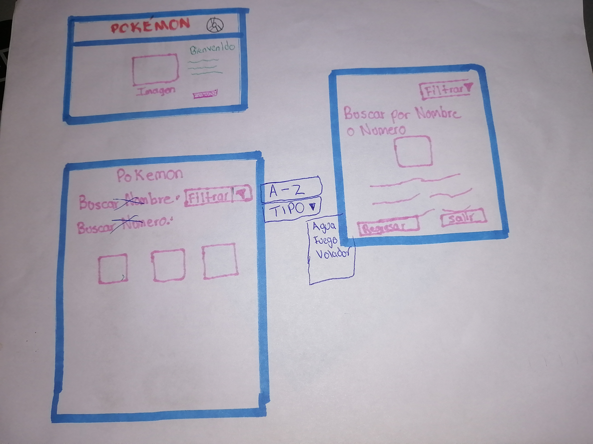

# Data Lovers

## 3. Objetivos de aprendizaje

### UX

- [✓] Diseñar la aplicación pensando y entendiendo al usuario.
- [✓] Crear prototipos para obtener _feedback_ e iterar.
- [✓] Aplicar los principios de diseño visual (contraste, alineación, jerarquía).
- [✓] Planear y ejecutar _tests_ de usabilidad.

### HTML y CSS

- [✓] Entender y reconocer por qué es importante el HTML semántico.
- [✓] Identificar y entender tipos de selectores en CSS.
- [✓] Entender como funciona `flexbox` en CSS.
- [✓] Construir tu aplicación respetando el diseño planeado (maquetación).

### DOM

- [✓] Entender y reconocer los selectores del DOM (querySelector | querySelectorAll).
- [✓] Manejar eventos del DOM. (addEventListener)
- [✓] Manipular dinámicamente el DOM. (createElement, appendchild, innerHTML, value)

### Javascript

- [✓] Manipular arrays (`filter` | `map` | `sort` | `reduce`).
- [✓] Manipular objects (key | value).
- [✓] Entender el uso de condicionales (`if-else` | `switch`).
- [✓] Entender el uso de bucles (`for` | `forEach`).
- [✓] Entender la diferencia entre expression y statements.
- [✓] Utilizar funciones (parámetros | argumentos | valor de retorno).
- [✓] Entender la diferencia entre tipos de datos atómicos y estructurados.
- [✓] Utilizar ES Modules (`import` | `export`).

### Pruebas Unitarias (_testing_)
- [✓] Testear funciones (funciones puras).

### Git y GitHub
- [✓] Ejecutar comandos de git (`add` | `commit` | `pull` | `status` | `push`).
- [✓] Utilizar los repositorios de GitHub (`clone` | `fork` | gh-pages).
- [✓] Colaborar en Github (pull requests).

### Buenas prácticas de desarrollo
- [✓] Organizar y dividir el código en módulos (Modularización).
- [✓] Utilizar identificadores descriptivos (Nomenclatura | Semántica).
- [✓] Utilizar linter para seguir buenas prácticas (ESLINT).

# Pokédex

Es una página contenedora de todos los datos necesarios para ser un maestro pokémon. Contiene todas las características e información necesaria para usar en Pokémon GO de los 151 primeros pokemones de la región de Kanto. Puedes encontrar a los personajes mediante filtros (órden alfabético de la A-Z y Z-A) o por categorías (agua, fuego, hielo, dragón, planta, veneno, etc). Es una web intuitiva y fácil de manejar. Sin necesidad de seguir instrucciones el usuario puede acceder a toda la información que contiene.

### Historias de usuario

#### Historia Uno
- Como jugador de pokemon quiero saber las debilidades de los pokemon para saber con cual jugar y ganar.
- El usuario podrá ver la ficha técnica de cada pokemon para saber sus debilidades.

#### Historia Dos
- Como usuario quiero filtar los pokemon por orden alfabético para encontrar mas rápido un pokemon.
- El usuario tendrá acceso a un filtro de orden A-Z y de Z-A.

#### Historia Tres
- Como usuario desea poder ver por Tipo de elemento a que corresponde cada pokemon.
- El usuario podrá filtrar por Tipo de elemento ; Si desea ver tipo Agua desplegara un lista con los que pertenecen a ese elemento.

#### Prototipo de baja fidelidad

- Prototipo Principal

- Prototipo despues de _feedback_

#### Prototipo de alta fidelidad

- Prototipo Principal

- Prototipo despues de _feedback_

#### Testeos de usabilidad

Objetivos de testeo

- Probar la usabilidad de los filtros de la aplicación.
- Probar si las categorías son las adecuadas.
